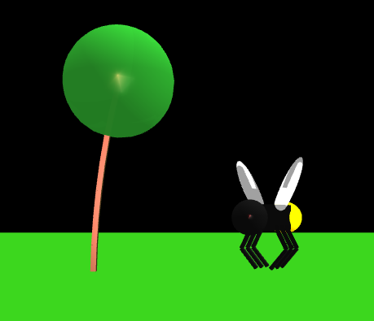

Polynation
===================
    UCLA CS 174A Assignment 1
    Winter 2016

    Alan Kha            904030522   akhahaha@gmail.com
-------------------------------------------------------------------------------
Overview
---------------
Use WebGL to draw an animated 3D scene with a bee orbiting a tree.

